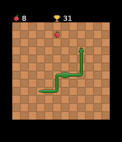

# Snake-Spiel für den ESP32



## Projektbeschreibung
Dieses Projekt ist eine Implementierung des klassischen Snake-Spiels auf einem ESP32-Mikrocontroller mit einem **Adafruit ST7789 TFT-Display** und einem **Joystick** zur Steuerung. Die Bewegung der Schlange erfolgt rasterbasiert, mit anpassbarer Geschwindigkeit und Offset-Einstellungen.


## Features
- Flackerfreies Zeichnen durch **LovyanGFX Sprites**
- **Double-Layer Rendering** (Hintergrund + Snake auf separaten Layern)
- Unterstützung für **RAW-Tilegrafiken** (2 Raw-Dateien für Tilesets)
- Modularer Code mit gut strukturierter Architektur (z. B. `SnakeGame`, `input.h`, etc.)
- Steuerung per **WiiChuck** oder Nunchuck über I²C

## Hardware-Voraussetzungen
### Benötigte Komponenten
- ESP32 Mikrocontroller
- Adafruit ST7789 TFT-Display (240x280 oder 240x240 Pixel)
- Analog-Joystick (2 Achsen, z. B. KY-023 Modul)
 <br> oder Nunchuk/WiiClassic mit Adafruit Wii Nunchuck Breakout Adapter
- Verbindungskabel, Breadboard (falls notwendig)

### Verkabelung
| Komponente | ESP32 Pin |
|------------|-----------|
| TFT SDA    | GPIO 35   |
| TFT SCL    | GPIO 36   |
| TFT CS     | GPIO 6    |
| TFT DC     | GPIO 7    |
| TFT RST    | GPIO 8    |

## Installation & Einrichtung (PlatformIO)
### Benötigte Software
- **Visual Studio Code**
- **PlatformIO Plugin**

### Projekt einrichten
1. Öffne **Visual Studio Code**.
2. Installiere das **PlatformIO Plugin** (falls noch nicht geschehen).
3. **Projekt von GitHub klonen**:
   ```sh
   git clone <GITHUB-REPOSITORY-URL>
   ```
4. **PlatformIO-Projekt in VS Code öffnen**:
   Öffne das PlatformIO Home Menü und wähle **Import Existing Project**.
5. **Bibliotheken installieren**:
   - Falls nicht automatisch installiert, füge folgende Bibliotheken in `platformio.ini` hinzu:
   ```ini
   [env:adafruit_qtpy_esp32s2]
   platform = espressif32
   board = adafruit_qtpy_esp32s2
   framework = arduino
   board_build.filesystem = littlefs
   board_build.partitions = no_ota_partitions.csv
   lib_deps = 
   	adafruit/Adafruit ST7735 and ST7789 Library@^1.11.0
   	lovyan03/LovyanGFX@^1.2.0
   	https://github.com/HS-Studio/WiiChuck.git
   ```
6. **Code kompilieren & auf den ESP32 hochladen**.
7. **Im PlatformIO-Menu unter Project Tasks/(Prjektname)/Platform/ auf "Upload Filessystem Image" klicken**

## Spielmechanik
### Bewegung
- Die Schlange bewegt sich in einem Grid (`grid_size`)
- Richtungswechsel nur orthogonal (links, rechts, oben, unten)
- Bewegung durch Joystick-Eingabe (`joy_x`, `joy_y`)

### Spielregeln
- **Fressen**: Berührt die Schlange das Essen, wächst sie.
- **Kollision**: Wenn der Kopf die Wand oder den Körper berührt, startet das Spiel neu.

## Erweiterungsideen
- Highscore speichern
- Mehrere Spielmodi
- Soundeffekte
- Animationen

## Fazit
Ein klassisches Snake-Spiel für den ESP32 (getestet auf QT Py ESP32-S2) mit optimierter, tile-basierter Darstellung.

